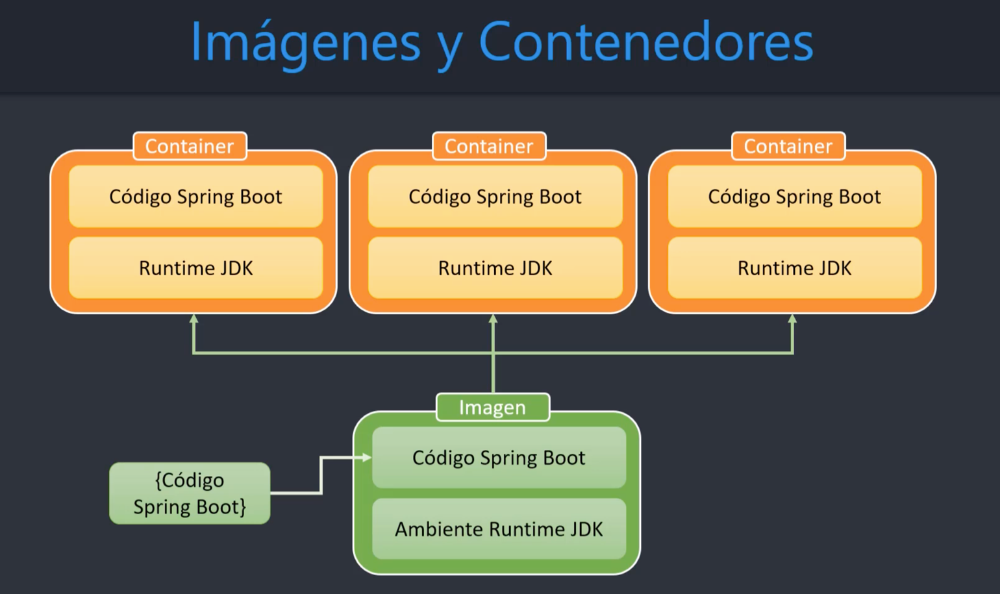
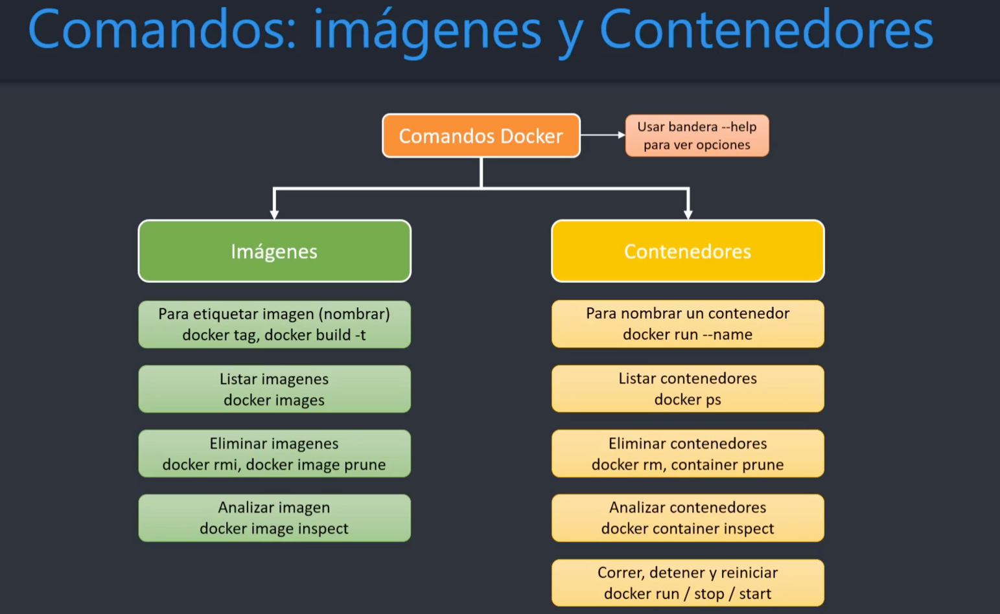
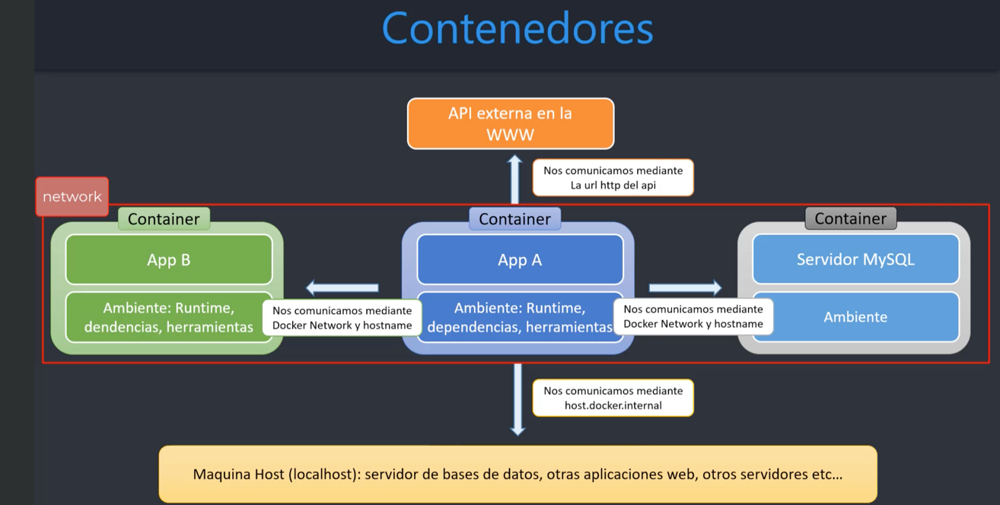

# SpringCloudKubernetes

Para crear el paquete (.jar) del msvc-usuarios.
Parado en la carpeta del msvc, ejecutar el comando ```./mvnw clean package -DskipTests```
Va a genera el .jar en la carpeta target.
Para ejecutar el servicio en la maquina local: ```java -jar ./taget/msvc-usuraios-0.0.1-SNAPSHOT.jar```

Construimos la imagen con el comando: ```docker build -t nombre-de-la-imagen .```
(. porque es el dir raiz, el mismo donde estamos parados, donde esta el archivo Dockefile)

Con el comando ```docker images``` vemos la imagen creada (en este caso, IMAGE ID = 3260a86e951e)
Con ```docker run 3260a86e951e``` va a ejecutar el contenedor, va a ejecutar el entrypoint y levantar la aplicacion



# Multi Stage Builder Pattern
uso de varios FROM para contruir la imagen en varias etapas (compilaciones)
"usar la imagen anterios para construir la siguiente"



Con el comando ```docker run -p 8001:8001 -d --rm usuarios``` levantamos un contenedor a partir de la imagen "usuarios"
* con el flag -d (detach) le decimos que no se atachado a la consola, corre en background
* con el flag --rm le decimos que se elimine el contenedor cuando se detenga el mismo (docker stop)

Entrar en modo interactivo dentro de nuestro contenedor: ```docker run -p 8001:8001 --rm -it usuarios /bin/sh```
(pero hay que modificar el Dockefile, ENTRYPOINT no permite que se ejecute otra cosa. Con CMD si, ese comando del docker file se reemplaza si pongo otro compado el la termina al momento de levantar el contenedor.
CMD es mas flexible, ENTRYPOINT mas restrictivo, puede ser mejor para seguridad por ej si no queremos que accedan a la linea de comandos)


## Copiar logs desde el contenedor a nuestra maquina local
Le decimos a spring que guarde los logs en ```logging.file.path=/app/logs```  
En el Dockerfile creamos esa folder en el contenedor: ```RUN mkdir ./logs```  
Una vez levantado el contenedor traemos ese archivo: ```docker cp 4f80b1c1323b:/app/logs ./logs```  


Inspeccionar la imagen: ```docker image inspect nombre-imagen```  
Inspeccionar el contenedor: ```docker container inspect 7249ff1e9cde```


Craemos una imagen taggeada con la etiqueta v2, si no ponemos nada sa latest  
```docker build -t usuarios:v2 . -f ./msvc-usuarios/Dockerfile```

Levantar un contenedor especificando un nombre y asi poder hacer docker start, stop, log, usando el nombre
```docker run -p 8001:8001 --rm -d --name container_name usuarios:v2```

&nbsp;

&nbsp;



## Comunicacion entre contenedores
Creamos las imagenes nuevamente  
```docker build -t courses . -f ./msvc-courses/Dockerfile```  
```docker build -t usuarios . -f ./msvc-usuarios/Dockerfile```  
Creamos la red  
```docker network create spring```  
Listamos las redes  
```docker network ls```  
Levantamos el microservicio usuarios en la red 'spring'  
```docker run -p 8001:8001 -d --rm --name msvc-usuarios --network spring usuarios```  
```docker run -p 8002:8002 -d --rm --name msvc-courses --network spring courses```  


## DOCKERIZAMOS LA BASE MYSQL
Descargamos la imagen  
```docker pull mysql:8```  
Levantamos el contenedor  
```docker run -d -p 3307:3306 --name mysql8 --network spring -e MYSQL_ROOT_PASSWORD=Passw0rd -e MYSQL_DATABASE=msvc_usersMYSQL:8```  

## Levantamos las DBs usando Volumenes
 ```docker run -d -p 3307:3306 --name mysql8 --network spring -e MYSQL_ROOT_PASSWORD=Passw0rd -e MYSQL_DATABASE=msvc_users -v data-mysql:/var/lib/mysql --restart=always mysql:8```  
 ```docker run -d -p 5532:5432 --name postgres14 --network spring -e POSTGRES_PASSWORD=sasa -e POSTGRES_DB=msvc_courses -v data-postgres:/bar/lib/postgresql/data --restart=always postgres:14-alpine```  


